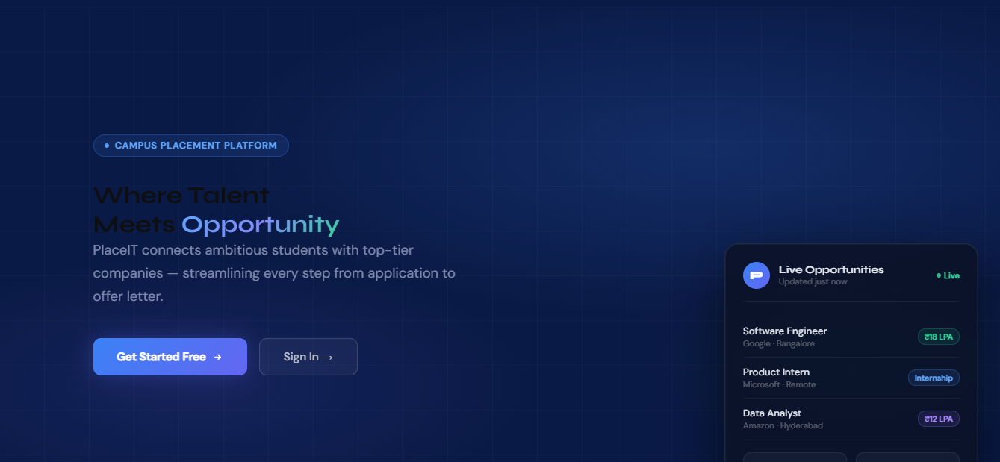
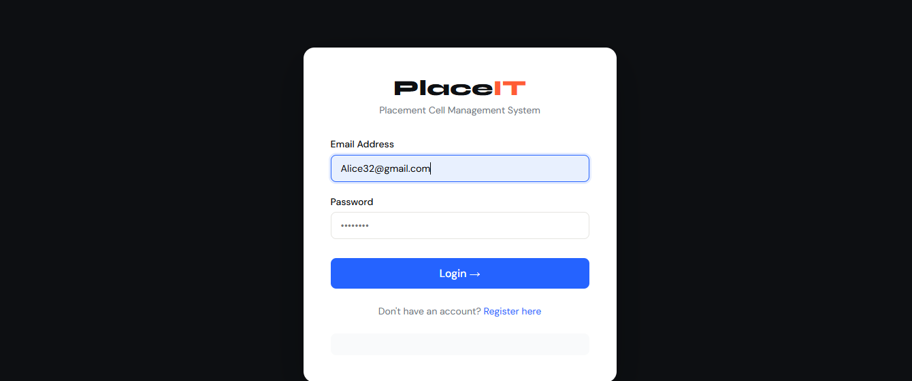
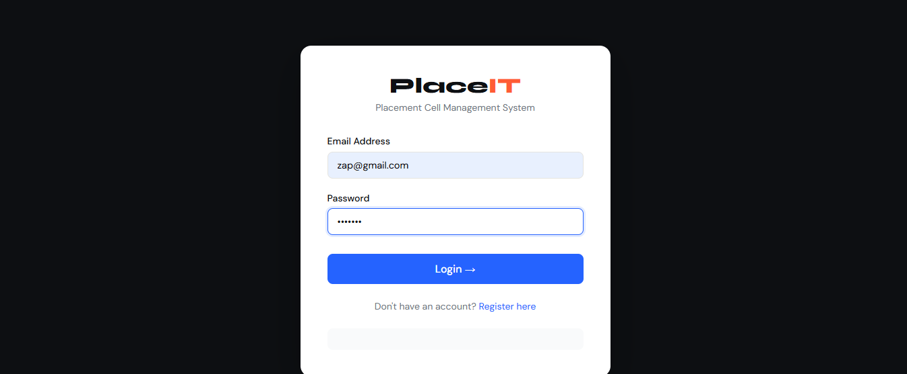
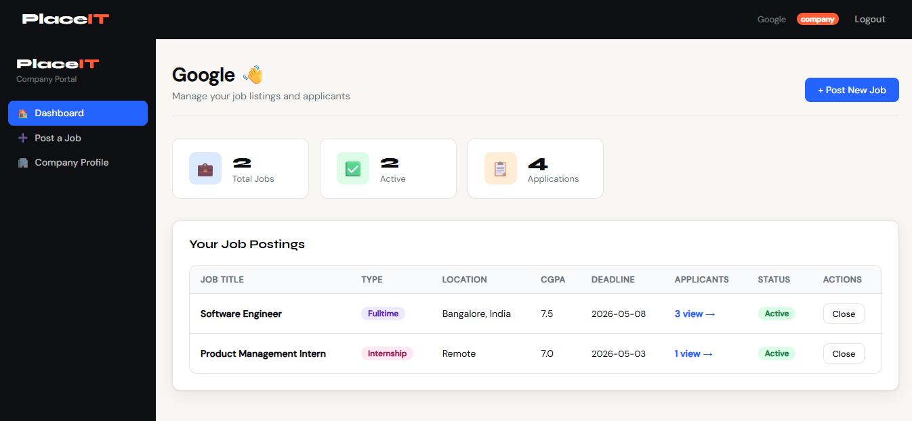
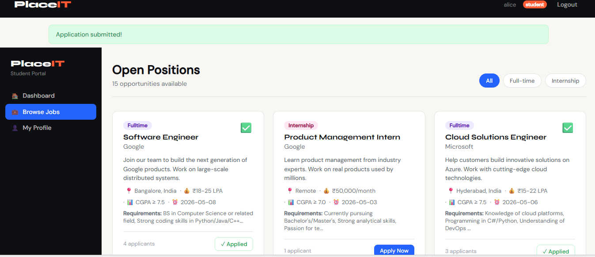

# PlaceIT — Placement Cell Management System

A full-stack web application built for college placement cells to manage students, companies, job postings, and applications — all in one place.

🌐 **Live Demo:** [https://placement-cell-6b63.onrender.com](https://placement-cell-6b63.onrender.com)

---

## About

PlaceIT streamlines the entire campus placement process. Students can build profiles and apply for jobs, companies can post openings and manage applicants, and placement coordinators get a complete overview through the admin dashboard.

---

## Features

### 🎓 Students

* Register and build a detailed profile (CGPA, branch, skills, bio)
* Upload resume (PDF/DOC)
* Browse full-time jobs and internships
* Apply with one click
* Track application status in real-time (Applied → Shortlisted → Selected → Offered)

### 🏢 Companies

* Register and manage company profile
* Post job/internship listings with CGPA cutoff, salary, and deadline
* View and manage all applicants per job
* Update applicant status and add notes
* Open/close job listings

### 🛡️ Admin

* Overview dashboard with placement statistics
* Monitor placement rate, active jobs, total applications
* View and manage all students and companies
* Enable/disable user accounts

---

## Tech Stack

| Layer       | Technology                         |
| ----------- | ---------------------------------- |
| Backend     | Python, Flask                      |
| Database    | PostgreSQL (Supabase)              |
| Frontend    | Jinja2, HTML, CSS, JavaScript      |
| Hosting     | Render                             |
| Auth        | Session-based with SHA-256 hashing |
| File Upload | Werkzeug                           |

---

## Project Structure

```
placement_cell/
├── app.py
├── database.py
├── requirements.txt
├── Procfile
├── static/
│   └── uploads/
│       └── resumes/
└── templates/
```

---

## Local Setup

### 1. Clone the repository

```bash
git clone https://github.com/sathiya-shree/placement-cell.git
cd placement-cell
```

### 2. Install dependencies

```bash
pip install -r requirements.txt
```

### 3. Set environment variable

Create a `.env` file:

```
DATABASE_URL=postgresql://your_connection_string_here
```

### 4. Run the app

```bash
python app.py
```

Open [http://localhost:5000](http://localhost:5000)

---

## Deployment

Hosted on Render with Supabase PostgreSQL as the database.

---

## Demo Credentials

| Role  | Email                                             | Password |
| ----- | ------------------------------------------------- | -------- |
| Admin | [admin@placement.edu](mailto:admin@placement.edu) | admin123 |

---

## Screenshots

> ⚠️ IMPORTANT: Make sure you have a folder named `screenshots` in the root of your repo and filenames match exactly.

### 🏠 Home Page



### 🔐 Login Page



### 🏢 Company Login Page



### 🏢 Company Dashboard



### 💼 Jobs Page



---

## License

MIT License — free to use and modify for educational purposes.
